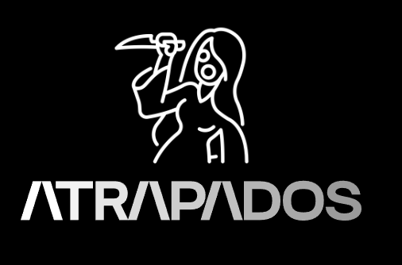

# Proyecto de Videojuego Serio Colaborativo

## Por:
- Paul Parizaca Mozo
- Avelino Lupo Condori
- Leon Davis Coropuna

## Introducción

El desarrollo de videojuegos serios ha mostrado un gran potencial en áreas como la educación y la capacitación, donde estos juegos no solo entretienen, sino que también facilitan la adquisición de conocimientos y habilidades específicas. Entre las modalidades más prometedoras se encuentran los juegos colaborativos, que permiten a los participantes trabajar en equipo y desarrollar habilidades sociales y de resolución conjunta de problemas. Sin embargo, aunque la colaboración es reconocida como un factor positivo en el aprendizaje, su implementación efectiva en videojuegos serios aún enfrenta desafíos importantes.

Investigaciones recientes destacan que los videojuegos colaborativos pueden ser una herramienta poderosa para fomentar la motivación y el compromiso de los jugadores al enfrentarse a metas comunes dentro del juego. No obstante, el diseño de estos juegos debe equilibrar cuidadosamente los objetivos educativos y la experiencia de juego para asegurar que el aprendizaje se integre de manera natural.

## Planteamiento del Problema

En el ámbito educativo y de formación de habilidades sociales, existe una creciente necesidad de herramientas innovadoras que fomenten la colaboración entre usuarios. Los videojuegos serios ofrecen una oportunidad para llenar este vacío, permitiendo la simulación de entornos colaborativos en los que los usuarios puedan mejorar competencias como la toma de decisiones grupales, la resolución de conflictos y el liderazgo compartido. Sin embargo, muchos videojuegos educativos actuales no logran integrar mecánicas de colaboración auténtica ni promueven habilidades interpersonales en situaciones de alta presión.

## Objetivos

### Objetivo General
Diseñar un videojuego serio colaborativo que facilite el aprendizaje y desarrolle habilidades interpersonales críticas, como la comunicación efectiva y la toma de decisiones grupales en situaciones de alta presión, mediante mecánicas de interacción centradas en la colaboración.

### Objetivos Específicos
- Diseñar una interfaz de usuario que fomente la interacción fluida y el trabajo en equipo.
- Desarrollar habilidades de comunicación efectiva en entornos de alta presión.
- Fomentar la toma de decisiones en grupo y la resolución de conflictos.
- Promover el liderazgo compartido y el apoyo mutuo entre los participantes.
- Iterar el diseño del juego basado en el feedback de los usuarios.

## Público Objetivo

El público objetivo incluye estudiantes, profesionales en formación y usuarios interesados en mejorar sus habilidades sociales e interpersonales. Este grupo abarca principalmente:
- **Edad y contexto educativo:** Jóvenes y adultos jóvenes (15 a 25 años) en contextos educativos.
- **Competencias tecnológicas:** Nivel intermedio en competencias digitales.
- **Interés en el desarrollo de habilidades:** Motivados por métodos interactivos y dinámicos.

### Motivaciones y Deficiencias
- **Motivaciones:** Búsqueda de experiencias de aprendizaje que combinen entretenimiento con el desarrollo de habilidades prácticas.
- **Deficiencias:** Pueden tener dificultades para mantener la motivación en métodos de aprendizaje convencionales y carecer de oportunidades para practicar colaboración efectiva en contextos de trabajo.

### Usuarios Objetivo
El foco está en estudiantes universitarios y profesionales en formación, interesados en aplicar conocimientos de manera práctica y en mejorar su desempeño en equipos de trabajo.

## ¿Qué hará el proyecto?

El proyecto consiste en desarrollar un videojuego serio colaborativo que permite a los usuarios mejorar habilidades de trabajo en equipo y colaboración a través de desafíos y tareas interactivas.

### Funcionalidades Principales
- **Desafíos colaborativos:** Tareas que fomentan la comunicación, coordinación y toma de decisiones en grupo.
- **Interacción en tiempo real:** Plataforma con chat de voz y reacciones en el juego.
- **Sistema de roles y habilidades:** Cada jugador asume un rol único que aporta al equipo y requiere colaboración para avanzar.

### Características de la Interfaz
- **Diseño intuitivo y accesible:** Con elementos visuales claros y controles simplificados.
- **Visualización de progreso:** Mostrar el avance del equipo en los desafíos.
- **Gamificación:** Logros, niveles de experiencia y recompensas para motivar a los usuarios.

### Innovación y Creatividad
El proyecto aporta una solución innovadora a la falta de herramientas efectivas para desarrollar habilidades colaborativas. La interfaz interactiva permitirá experimentar situaciones reales de colaboración en un entorno controlado.

## Análisis de sistemas existentes

### Aplicaciones Competidoras

#### “Keep Talking and Nobody Explodes”
- **Aspectos Positivos:** Fomenta una comunicación intensa y efectiva; diseño sencillo e intuitivo.
- **Aspectos Negativos:** Dependencia en comunicación verbal; falta de interacción física.

#### “We Were Here”
- **Aspectos Positivos:** Estimula la colaboración y el pensamiento crítico.
- **Aspectos Negativos:** Falta de interacción física y manipulación activa del entorno.

### Diferenciación de Nuestro Proyecto
Nuestro proyecto se diferencia al integrar interacciones físicas que reflejan acciones del mundo real, donde las acciones de un jugador impactan en el entorno del otro. Esto mejora la inmersión y permite que los jugadores se enfoquen en sus habilidades interpersonales en un entorno de alta presión.

## Artículos Relacionados

1. **Natural User Interface- Next Mainstream Product User Interface**
   - **Resumen:** Describe el desarrollo de la interfaz de usuario natural y se enfoca en sus características típicas.
   - **Ventajas:** Enfoque en la interacción natural, multicanalidad.
   - **Desventajas:** Limitaciones tecnológicas, costos de desarrollo.

2. **A Natural User Interface implementation for an Interactive Learning Environment**
   - **Resumen:** Presenta un entorno de aprendizaje interactivo llamado CREA y JUEGA.
   - **Ventajas:** Motivación, disfrute, participación activa.
   - **Desventajas:** Limitación en contenido educativo, efecto de novedad.

3. **Exploring the effects of a serious game-based learning package for disaster prevention education**
   - **Resumen:** Paquete de aprendizaje basado en juegos para educación en prevención de desastres.
   - **Ventajas:** Interactividad, aumento del interés.
   - **Desventajas:** Dependencia de la tecnología.

4. **Revolutionizing elementary disaster prevention education and training via augmented reality-enhanced collaborative learning**
   - **Resumen:** Investiga el uso de AR en educación y entrenamiento sobre prevención de desastres.
   - **Ventajas:** Colaboración mejorada, accesibilidad.
   - **Desventajas:** Desafíos de implementación, dependencia tecnológica.

